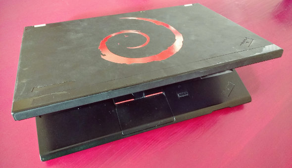

Title: What new laptop?
Slug: new-laptop
Date: 2016-04-05 10:20
Status: published
Tags: tech
Attachments: pic/thinkpX230.jpg

It will soon be time to replace my current laptop, a three
year old Thinkpad X230; it probably is my fifth X-series over
the years. They deservedly had a good reputation for build
quality, and to run Linux.

However, I find it unlikey that my next machine will be another
Thinkpad. 

Criteria for my new laptop would be the following:

* fan-less
* non-glossy screen
* 16GB RAM
* decent size SSD
* track-point
* decent keyboard
* digital video-out
